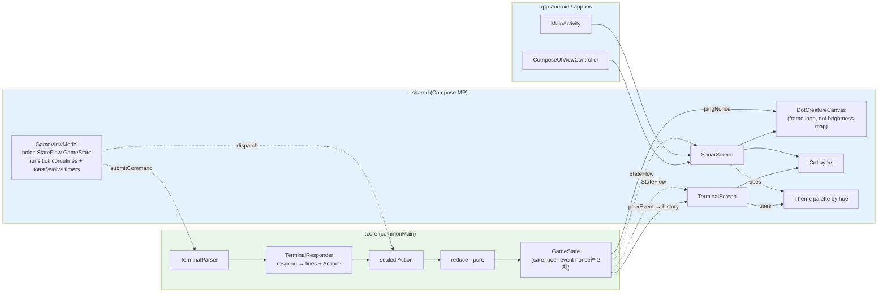

# Jvolution — KMP 앱 아키텍처 계획 + 1차 마일스톤(소나+터미널)

> **출처:** 원격 ultraplan 세션 (2026-05-27 승인). 이 파일은 그 산출물을 그대로 보존한다.
> **상태:** 1차 마일스톤 PR 도착 대기 중. team-review(2026-05-29, architect·code-reviewer·kotlin-reviewer)의 블로커/필수 권장사항을 이 문서에 반영함(transient 상태 소유·터미널 history 위치·Action 어휘 정합·`:core` jvm() 타깃·koinViewModel iOS·CrtShader phase 2 연기 등) — PR 도착 시 diff와 함께 재검토.

## Context

저장소는 `Kotlin/KMP-App-Template` 기반 KMP 스캐폴드(`shared/` + `androidApp/` + `iosApp/`) 위에 Met Museum 샘플(`screens/list`, `screens/detail`, `data/Museum*`)이 그대로 남아 있는 상태다(`shared/src/commonMain/kotlin/today/superb/jvl/App.kt:1`, `di/Koin.kt:1`).

`demo/docs/`에 7개 framework-agnostic 명세(개요·케어·피어·전투·터미널·UI·템플릿 평가)가 정리돼 있고, `demo/*.jsx`에 동작하는 JS 프로토타입이 있다. 명세는 모든 수치(스탯 증감, 확률, 타이밍, RPS 매트릭스, 데미지 공식, 드리프트 규칙)를 명시하므로 그대로 KMP로 옮길 수 있다.

이번 계획의 목적은 두 가지다:

1. **아키텍처 결정.** Museum 샘플을 걷어내고, 명세가 가정하는 게임 구조(중앙 reducer + tick 루프 + Compose Canvas 렌더)에 맞는 모듈/상태/렌더 경계를 잡는다. 후속 `:wear-android` / `:wear-watchos` 추가가 자연스러우려면 순수 Kotlin 도메인이 UI와 분리돼 있어야 한다(템플릿 평가 doc 권고).
2. **1차 마일스톤 실행.** 첫 화면은 **소나 + 터미널**. 두 화면은 명세상 같은 세로 레이아웃에 동시에 표시되는 sibling이며(`demo/docs/06-ui-visual.md`의 `메인 베젤(가변)` + `터미널(315)`), 합쳐서 게임 reducer·tick 루프·CRT 연출·Canvas 렌더·명령 디스패치까지 전체 데이터 흐름을 한 번에 검증할 수 있다.

---

## 아키텍처 결정

### 모듈 구조: 3분할 (`:core` / `:shared` / app)

```
jvolution/
├── core/          (NEW) 순수 Kotlin KMP 라이브러리. commonMain만 사용.
│                       ─ 도메인 모델, reducer, RNG, RPS 매트릭스, NPC AI.
│                       ─ Compose · Ktor · Coil · Koin 의존 금지.
│                       ─ 추후 watchOS Watch App이 `Shared.framework`로 소비할 표면.
├── shared/        Compose Multiplatform 공유 UI. :core 의존.
│                  ─ 테마/팔레트, CRT 레이어, Canvas 렌더, 화면, ViewModel, DI.
├── androidApp/    Android 폰 진입점 (기존 유지).
└── iosApp/        iOS 폰 진입점 (기존 유지).
```

평가 doc은 5분할(`core-game` / `core-data` / `shared-ui` / `app-android` / `app-ios`)을 권고하지만, **현 단계에는 영속화·네트워킹·analytics가 없으므로 `core-data`는 불필요**하고 `shared-ui`는 기존 `:shared`가 이미 그 역할이다. 핵심 경계(순수 도메인 ↔ Compose UI) 하나만 지키고, 페르시스턴스가 들어오는 시점에 `:core-data`를 갈라낸다.

### 단일 GameState + 순수 reducer

JS 데모(`demo/app.jsx`의 `reduce(s, a)`)와 동형으로 간다. 사유:

- 명세는 액션 단위로 기술돼 있다(`feed: hunger -0.25`). 순수 함수가 1:1로 떨어진다.
- 모든 액션이 전역 상태(toast, view, peers, battle, pendingRequest)를 만진다 — 화면별로 가르면 인위적 경계가 생긴다.
- 순수 reducer는 commonMain에서 테스트 가능. JVM 단위테스트로 모든 케어 규칙·드리프트·RPS 매트릭스를 검증한다.

trade-off: `view`/`SetView`는 순수 도메인이 아니라 폰 전용 프레젠테이션 관심사다. MVP 단순함을 위해 1차는 GameState에 둔다(워치는 그 필드를 무시). 폰/워치 분기가 부담이 되면 그 시점에 `:shared`의 UI-state로 분리한다 — 의식적으로 기록만 해 둔다.

`:core`에 둘 것:

```kotlin
// core/commonMain
data class GameState(...)              // 데모 initialState() 1:1 포팅. 모든 필드 val,
//                                        컬렉션은 read-only List/Map (StateFlow 재구성 계약 보호).
sealed interface Action { ... }        // tick, ping, feed, play, discipline, …, clearToast
fun reduce(state: GameState, action: Action, rng: Rng): GameState
interface Rng { fun nextFloat(): Float; fun nextLong(): Long }
class SeededRng(seed: Long) : Rng       // 테스트 결정성
```

### Tick 루프와 프레임 루프 분리

명세상 시간축이 **세 층**으로 다르다:

| 층 | 주기 | 어디서 | 무엇 |
|---|---|---|---|
| Care tick | ~1.5s | `viewModelScope` `delay` | 스탯 드리프트(`Action.Tick(dt)`) |
| Peer tick | ~1.0s | 같음, 두 번째 코루틴 | 피어 위치/AI 판정(`Action.PeerTick`) — 2차 마일스톤 |
| Frame | ~16ms | `withFrameNanos` (Composable 내부) | 도트 phosphor 감쇠, 스윕 위치, hue lerp |

핵심 원칙: **GameState는 tick 층까지만**. 프레임 단위 시각 상태(도트 brightness 맵, hue lerp 위치, CRT 스캔밴드 ~7s·플리커 ~2.6s 등 장주기 연출)는 Composable 내부 `remember`/`mutableStateOf`로 들고 reducer에 흘리지 않는다. 데모(`creature.jsx:203`의 `dotsRef`)도 동일 패턴. 트리거만 reducer에서 nonce로 보낸다(`pingNonce`).

프레임 루프는 반드시 `LaunchedEffect(Unit) { while (true) { withFrameNanos { … } } }` 안에서 돈다(자주 바뀌는 값으로 key를 주면 재구성마다 루프가 재시작되는 고전적 버그). nonce 트리거 소비도 `LaunchedEffect(state.pingNonce) { … }`로 받고, 그리기 람다에서 직접 읽지 않는다.

### Transient 상태: reducer가 켜고 ViewModel이 타이머로 끈다

데모에는 reducer 바깥 타이머로 자동 소멸하는 transient 상태가 3종 있다. 이들은 **reducer가 켜고(순수), `GameViewModel`이 코루틴 타이머로 끈다**. reducer는 끝까지 순수하게 유지한다.

| 상태 | 켜기 (reducer) | 끄기 (ViewModel 타이머) | 데모 |
|---|---|---|---|
| `toast` | feed/play 등이 `state.toast` 설정 | `state.toast` 변할 때 1400ms 후 `Action.ClearToast` (이전 타이머 취소) | `app.jsx:749-754`, 명세 `02:58` |
| `evolving` | `Action.Evolve`가 `evolving=true` | 2200ms 후 `Action.EvolveComplete` (단계 전이) | `app.jsx:797-802`, `02:104` |
| sonar sweep | `Action.Ping`이 `pingNonce++` | frame-state — SonarScreen이 `pingNonce` 변화를 `LaunchedEffect`로 받아 `withFrameNanos` 1600ms sweep(`scanProgress` 0→1)을 구동, `DotCreatureCanvas`에 전달. GameState 무관. | `screens.jsx:91-115` |

`GameViewModel` 책임에 **토스트 만료 코루틴 + evolve 스케줄러**를 명시한다. `Action`에 `ClearToast`를 추가한다.

### 터미널 history는 ViewModel-local, peer-event는 GameState nonce (구현 확정)

출력 history(`out`/`sys`/`in` 라인)는 **ViewModel-local `MutableStateFlow<List<TerminalLine>>`**에 둔다(데모도 동일 — history는 컴포넌트 local, `screens.jsx:484-491`). history는 순수 프레젠테이션(스크롤·표시)이라 reducer 순수성·StateFlow 재구성 비용 측면에서 GameState 밖이 낫다. 2차 peer-echo는 데모처럼 **event를 GameState에 nonce로 두고**(`peerEventNonce`/`peerEventLatest`, `app.jsx:65-66`), 화면이 nonce 변화를 history에 append한다(`screens.jsx:499-509`).

- `Action`에 `terminalInput`은 **두지 않는다**(데모에 없음). 명령 파이프라인: `GameViewModel.submitCommand(text)` → `parse(trimmed)` → `respond(cmd, state, rng)`가 `{ lines, action?, clearScreen }` 반환 → ViewModel이 입력 에코(`name@nautilus:~$ cmd`)+`lines`를 history에 append하고 `action`을 reduce로 흘린다.
- `clear`는 `TerminalResponse.clearScreen`(ViewModel이 history 교체) — `Action`이 아니다. 입력 히스토리(`↑↓`)도 비도메인이라 `TerminalScreen` local `remember`.
- 데이터 플로 다이어그램의 `peerEventNonce → history`·`respond → Action?` 경로는 위 구조 기준(2차에 peer nonce 활성화).

명령어 `scold` → `Action.Discipline`으로 매핑한다(데모 `case 'discipline'`, `app.jsx:200`). `sleep`/`wake`는 토글(`asleep:!asleep`)이 아니라 `TerminalResponder`에서 현재 상태를 보고 멱등 처리한다.

### Hue 기반 팔레트(oklch 회피, 첫 패스)

데모는 oklch + CSS 변수로 한 hue만 바꿔 전체 색을 회전시킨다. Compose Color는 sRGB라 oklch 변환 유틸을 짜야 한다. **첫 패스는 hue 4종(green=155 / amber=75 / blue=220 / alert=25)에 대해 phos / phos-mid / phos-dim / phos-grid 색을 사전 계산해 `Theme` 객체로 노출**한다. oklch 동적 변환은 후속 단계(셰이더 도입 시점)에서 추가.

UI 팔레트(이산 4종)와 생명체 alert 시 **부드러운 hue 보간**(`06:57`, 데모 `creature.jsx:206-244`의 `hueLerpRef`)은 별개 메커니즘이다. 후자는 `DotCreatureCanvas` 내부에서 hue 각도를 매 프레임 lerp하는 frame-state로, 2차(전투/peer로 alert가 실제 발생)에 처리한다. 1차는 alert 전환이 없으므로 이산 팔레트로 충분.

### CRT 연출: 첫 패스는 Compose 네이티브, 셰이더는 후속

평가 doc(라인 76–105)이 제안한 `expect class CrtShader` (AGSL/SkSL) 패턴은 정답이지만, **첫 마일스톤은 셰이더 없이 Compose `Canvas` + `drawLine`/`drawRect`로 스캔라인·비네트·플리커를 근사**한다. 사유: 셰이더 플러밍에 발이 묶이지 않고 게임 데이터 플로 검증을 먼저 끝낸다. `CrtLayers` Composable에 `expect/actual` 분기 자리를 미리 비워두되, actual 구현은 phase 2 작업으로 분리.

### Expect/actual 시임은 처음부터 노출만

지금 actual을 짤 필요는 없지만 일부 **시그니처는 박아 둔다** — 그래야 나중에 화면별 코드를 안 갈아엎는다:

- `expect fun nowMillis(): Long` — 데모의 `Date.now()` 대체 (lineage `hatchedAt`/`archivedAt`). **reducer는 이를 직접 호출하지 않는다** — wall-clock 타임스탬프는 `Action`(예: `Tick`, `Evolve`)의 payload로 운반해 reducer를 완전 순수·결정성으로 유지한다. ViewModel이 액션 생성 시 `nowMillis()`를 찍어 넣는다.
- `expect class HapticFeedback` — 피드백 토스트 옆에 추후 진동 추가.

**주의 — `expect class CrtShader`는 1차에 선언하지 않는다.** `expect` 선언은 동일 마일스톤의 모든 타깃(android/iosArm64/iosSimulatorArm64)에 `actual`을 강제하므로 "선언만, actual은 phase 2"는 **빌드가 깨진다**. 1차는 plain `CrtLayers` Composable에 삽입점 주석만 남기고, `expect/actual` 쌍은 actual을 작성하는 phase 2에 함께 도입한다.

`kotlin.time.TimeSource.Monotonic`은 commonMain에 있으니 tick의 dt(경과시간) 계산은 expect 없이 처리한다. wall-clock(`nowMillis`)과 monotonic(`dt`)은 용도가 다르므로 둘을 합치지 않는다.

### 데이터 플로 다이어그램



핵심 흐름: 사용자 입력(터미널 텍스트) → `TerminalParser.parse` → `TerminalResponder.respond`가 `{lines, Action?}` 반환 → `GameViewModel`이 `lines`를 history에 append하고 `Action?`만 `reduce`로 흘림 → 새 `GameState` → Compose 재구성. 프레임 루프는 GameState 바깥에서 자율 동작하되 `pingNonce` 같은 트리거 값만 GameState에서 읽는다.

---

## 1차 마일스톤 — 소나 + 터미널 구현

**범위:** Museum 샘플 제거, `:core` 생성, `:shared`에 게임 reducer + GameViewModel + SonarScreen + TerminalScreen + CrtLayers + Theme + Ghost 종 렌더 1개. 안드로이드/iOS 두 플랫폼에서 빌드·실행 가능.

**스킵(후속 마일스톤):** 레이더·전투·계보·DND·reset·mute·블롭/젤리/스퀴드/픽셀 4종. 터미널은 이들에 대해 `command not found` 또는 `module pending` 응답으로 우아하게 처리.

### 제거할 것

```
shared/src/commonMain/kotlin/today/superb/jvl/data/MuseumObject.kt
shared/src/commonMain/kotlin/today/superb/jvl/data/MuseumRepository.kt
shared/src/commonMain/kotlin/today/superb/jvl/data/MuseumStorage.kt
shared/src/commonMain/kotlin/today/superb/jvl/data/MuseumApi.kt
shared/src/commonMain/kotlin/today/superb/jvl/screens/list/        (디렉터리)
shared/src/commonMain/kotlin/today/superb/jvl/screens/detail/      (디렉터리)
shared/src/commonMain/kotlin/today/superb/jvl/screens/EmptyScreenContent.kt
```

`shared/build.gradle.kts`의 ktor / coil 의존성은 **유지**(템플릿 평가 doc 권고: 추후 점수 동기화·이미지에 다시 쓸 가능성). 단, 첫 PR 빌드에 영향이 없도록 사용처만 사라지면 된다.

### 추가할 것 — `:core`

`core/build.gradle.kts` — KMP 라이브러리 신규. 타깃: `androidLibrary(namespace = "today.superb.jvl.core")` + `iosArm64` + `iosSimulatorArm64` + **`jvm()`**. `jvm()`을 둬야 commonTest의 reducer 단위테스트가 host에서 `:core:jvmTest`로 빠르게 돈다(아래 Verification의 "JVM 단위테스트" 약속이 실제로 성립). 의존성은 `kotlin.stdlib`만(서드파티 제로).

순수 도메인 경계(`:core`에 Compose/Ktor/Coil/Koin 금지)는 컨벤션만으로는 강제되지 않으므로, `jvmTest`의 `CorePurityTest`가 commonMain 소스를 스캔해 금지 import(`androidx.*`/`org.jetbrains.compose`/`io.ktor`/`coil`/`koin`)를 단정한다(외부 의존성 없이 JVM 파일 접근만 사용 — Konsist 불필요). 워치 컴패니언(`:wear-watchos`)이 `:core`를 직접 framework로 소비할지 vs `:shared` 경유할지는 후속 결정 — 직접 소비하려면 `:core`에 `binaries.framework {}` 선언이 필요하다(1차 범위 밖).

`settings.gradle.kts`의 `include(":shared")` 줄 옆에 `include(":core")` 추가(라인 번호 대신 심볼 기준).

```
core/src/commonMain/kotlin/today/superb/jvl/core/
├── GameState.kt           // data class GameState, Peer, BattleState, LineageEntry
├── Action.kt              // sealed interface Action: Tick, Ping, Feed, Play, Clean, Sleep,
│                          //   Train, Discipline, Heal, Evolve, EvolveComplete, Rename,
│                          //   SetView, Talk, ClearToast, ClearTerminal
│                          //   (명령어 scold → Action.Discipline 매핑)
├── Reducer.kt             // fun reduce(state, action, rng): GameState — 데모 reduce() 포팅
├── Stages.kt              // enum class Stage { Egg, Larva, Juvenile, Adult }
├── Species.kt             // enum class Species { Ghost, Blob, Jelly, Squid, Pixel }
├── Mood.kt                // fun moodLabel(state): MoodLabel — 우선순위 8단계
├── TalkPool.kt            // fun talkLine(state, rng): String — 명세 02 우선순위 표
├── Rng.kt                 // interface Rng, class SeededRng, class DefaultRng
├── terminal/
│   ├── TerminalCommand.kt // sealed class TerminalCommand
│   ├── TerminalParser.kt  // fun parse(input: String): TerminalCommand
│   ├── TerminalResponder.kt // fun respond(cmd, state): TerminalResponse (lines + Action?)
│   └── StatusReadout.kt   // fun renderStatus(state): List<String> — `status` 명령용 박스
└── peers/
    └── (피어 모델만 정의, 드리프트/AI는 2차 마일스톤)
```

`core/src/commonTest/kotlin/today/superb/jvl/core/ReducerTest.kt` — 명세에 적힌 모든 케어 액션 수치를 deterministic 검증(예: feed → hunger -0.25 within [0,1]). `SeededRng(42L)`로 재현성 보장.

### 추가할 것 — `:shared`

```
shared/src/commonMain/kotlin/today/superb/jvl/
├── App.kt                  // (기존 교체) MaterialTheme 대신 JvlTheme, NavHost 제거(단일 화면).
├── ui/
│   ├── theme/
│   │   ├── Hue.kt          // enum Hue(deg: Int) — Green(155), Amber(75), Blue(220), Alert(25)
│   │   ├── Palette.kt      // data class Palette(phos, phosMid, phosDim, phosGrid, bg)
│   │   ├── Theme.kt        // @Composable fun JvlTheme(hue: Hue, content: …)
│   │   └── Typography.kt   // VT323 / JetBrainsMono / ShareTechMono — 폰트 리소스 wiring
│   ├── crt/
│   │   └── CrtLayers.kt    // 스캔라인·노이즈·비네트·플리커·스캔밴드 (Compose Canvas 근사)
│   │                       //   셰이더 삽입점은 주석으로만. expect/actual은 phase 2에 도입.
│   ├── bezel/
│   │   └── MainBezel.kt    // 메인 화면을 감싸는 frame Composable (military bezel 1종만)
│   ├── frame/
│   │   └── DeviceFrame.kt  // 명세 06 — status bar / header / bezel / terminal / home indicator
│   │                       //   기준 캔버스 402x874 비율 유지
│   ├── sonar/
│   │   ├── SonarScreen.kt          // 상단 readout + 스테이지 + 도트 생명체 + 토스트 + 진화 플레이트
│   │   ├── DotCreatureCanvas.kt    // Compose Canvas, frame loop, phosphor decay
│   │   └── species/
│   │       └── Ghost.kt            // shape function — 첫 패스 1종만
│   ├── terminal/
│   │   ├── TerminalScreen.kt       // LazyColumn(history, key={it.id}) + TextField(input) + ↑↓ 히스토리
│   │   └── TerminalLineRow.kt      // sys/in/out 라인 종류별 색상
│   └── toast/
│       └── Toast.kt                // 상단 1.4s 배너
├── viewmodel/
│   └── GameViewModel.kt    // androidx.lifecycle.ViewModel. holds MutableStateFlow<GameState>,
│                           //   runs care-tick coroutine, exposes dispatch(action) + submitCommand(text).
│                           //   tick 루프 + StateFlow 방출은 viewModelScope의 Main.immediate에서
│                           //   (reduce는 순수·경량이라 IO 불필요). 토스트 만료/evolve 스케줄러도 여기.
└── di/
    └── Koin.kt             // (기존 교체) GameViewModel + Rng 바인딩만 남김
```

`koinViewModel()`(`App.kt`)은 `LocalViewModelStoreOwner`를 요구한다. iOS는 `iosApp`의 `ComposeUIViewController` 진입점이 store owner를 제공해야 하므로, Museum 잔존 상태의 iOS 진입점이 이를 공급하는지 **확인·조정하는 것을 1차 마일스톤 task로** 포함한다(미공급 시 iOS 한정 런타임 크래시 — 체크리스트 9번에서야 늦게 드러남).

Compose Resources에 폰트 추가: `shared/src/commonMain/composeResources/font/` 에 1차 실사용 폰트만(본문 mono = JetBrains Mono, `06:128`). VT323/ShareTechMono는 실제 사용처가 생길 때 추가(미사용 리소스 번들 방지). `FontFamily`는 top-level `val`이 아니라 `@Composable` 스코프에서 `org.jetbrains.compose.resources.Font(Res.font.…)`로 구성한다. 폰트 라이선스(SIL OFL)는 `shared/src/commonMain/composeResources/font/OFL.txt`로 동봉.

`shared/build.gradle.kts`의 navigation/lifecycle 의존성은 유지(viewmodel용). 사용처가 사라지는 ktor/coil/`compose-material3`는 보존하되 `// keep: 2차 점수동기화·이미지·다이얼로그 복원 예정` 마커를 단다.

### `App.kt` 새 구조 (개략)

```kotlin
@Composable
fun App() {
    val vm: GameViewModel = koinViewModel()
    // 1차는 항상 포그라운드 단일 화면 — collectAsState로 충분.
    // (collectAsStateWithLifecycle은 iOS에서 lifecycle 게이팅이 없어 collectAsState와 동등.)
    val state by vm.state.collectAsState()
    val hue = if (state.pendingRequest != null) Hue.Alert else state.tweaks.theme.hue
    // JvlTheme 내부에서 palette는 remember(hue) { paletteFor(hue) }로 캐싱.
    JvlTheme(hue = hue) {
        DeviceFrame(
            header = { HeaderStrip(state) },
            bezel = {
                MainBezel(label = "SONAR-OBS · MK.III · ${state.stage.name.uppercase()}") {
                    // 1차 마일스톤: SonarScreen만. tree/radar/battle은 후속.
                    SonarScreen(state, vm::dispatch)
                }
            },
            terminal = {
                TerminalScreen(state, onSubmit = vm::submitCommand)
            },
        )
    }
}
```

### 데모 ↔ Kotlin 1:1 포팅 매핑(참조용)

| 데모 (JS) | Kotlin 위치 |
|---|---|
**1차 범위:**

| 데모 (JS) | Kotlin 위치 |
|---|---|
| `demo/app.jsx:53` `initialState()` | `core/GameState.kt::GameState.initial()` |
| `demo/app.jsx:116` `reduce(s,a)` | `core/Reducer.kt::reduce(state, action, rng)` |
| `demo/screens.jsx:90` `SonarScreen` | `ui/sonar/SonarScreen.kt` |
| `demo/creature.jsx:191` `SonarCreature` | `ui/sonar/DotCreatureCanvas.kt` |
| `demo/creature.jsx:87` `SPECIES.ghost` | `ui/sonar/species/Ghost.kt` |
| `demo/screens.jsx:483` `TerminalScreen` | `ui/terminal/TerminalScreen.kt` + `core/terminal/*` |
| `demo/screens.jsx:55` `CRTLayers` | `ui/crt/CrtLayers.kt` |
| `demo/screens.jsx:118` mood label 우선순위 | `core/Mood.kt::moodLabel()` |
| `demo/screens.jsx:549` `status` 박스 렌더 | `core/terminal/StatusReadout.kt` — 순수 `List<String>`만 반환, 색/레이아웃은 `:shared` |

**후속 마일스톤(1차에 파일 생성 안 함):**

| 데모 (JS) | Kotlin 위치 |
|---|---|
| `demo/app.jsx:39` `makePeers()` | `core/peers/PeerRoster.kt::makePeers(rng)` (2차 — 레이더) |

데모의 수치(`PULSE_DURATION = 1.6`, `BEAM_HALFWIDTH = 0.05`, `TRAIL_REACH = 0.45`, decay 등)는 그대로 가져온다.

---

## Verification

**빌드:**

```sh
./gradlew :core:jvmTest                         # commonTest+jvmTest(reducer·터미널·순수성 가드) — host에서 빠른 루프
./gradlew :core:compileCommonMainKotlinMetadata # commonMain 플랫폼 누수 없음(전 타깃 컴파일 가능) 확인
# iOS 타깃 실제 컴파일은 Kotlin/Native가 macOS를 요구 — Linux 불가. macOS/CI에서:
./gradlew :core:compileKotlinIosArm64 :core:compileKotlinIosSimulatorArm64
./gradlew :core:allTests                        # 전 타깃 테스트(macOS에서 iOS 시뮬 포함)
./gradlew :androidApp:assembleDebug
./gradlew :shared:embedAndSignAppleFrameworkForXcode
```

CI가 없으므로(저장소에 `.github/workflows/` 없음) 평가 doc 권고대로 KMP-App-Template의 `Build Android app` / `Build iOS app` 워크플로를 가져올지는 별건. 이번 PR 범위 밖.

**기능 체크리스트 (수동):**

1. Android emulator에서 앱 기동 → `DeviceFrame` 위→아래로 status bar / header / 메인 베젤 / 터미널 / home indicator가 보인다.
2. 메인 베젤에 도트 ghost 생명체가 천천히 호흡하며 ~5초 주기 펄스가 좌→우로 지나간다(phosphor 잔광 확인).
3. 상단 readout에 mood 라벨이 `NOMINAL`로 표시되고, 시간이 지나면(hunger > 0.75) `HUNGRY`로 바뀐다.
4. 터미널에 `help` 입력 → 명령 목록 출력. `status` → 박스형 readout. `feed` → `NOM NOM` 토스트 + log 1줄.
5. `↑`/`↓`로 명령 히스토리 탐색.
6. `ping` → 도트 생명체에 즉시 스윕 1회 + `bond` 약간 증가.
7. `sleep` → mood `ASLEEP` + 생명체 밝기 디밍(`sleepFactor`) + `GOOD NIGHT` 토스트. `wake` → 복귀. (우상단 `zzz`·중앙 EVOLVING 오버레이는 후속 — 1차는 mood 라벨 + 밝기로 표현.)
8. `radar` / `accept` / `tree` 등 미구현 명령 → `command not found` 또는 `module pending` 우아 응답(앱 크래시 없음). 1차에서 `tree`/`radar`는 **`SetView`를 dispatch하지 않고** responder가 "module pending"만 반환한다(단일 화면이라 `state.view`↔렌더 desync 방지). 진화(evolve)는 1차에서 구현하되 자동 트리거는 미검증 — 스테이지 라벨은 기본 `EGG` 고정으로 본다.
9. iOS 시뮬레이터(Xcode)에서 같은 시나리오 동작 확인.

**테스트:** `:core:jvmTest`로 모든 케어 액션의 스탯 증감 + clamp 경계([0,1]) + tick 드리프트(awake/asleep) + mood 라벨 우선순위(도달 불가한 `SCOLDED`는 데모 as-is 버그이므로 검증 제외 — `02:151` 참조) + `evolve`→`evolveComplete` 단계 전이 + 터미널 파서 + `status`/`help`/`talk`(RNG 결정성) 출력을 검증. RNG는 `SeededRng(42L)` 고정. reducer가 `nowMillis()`를 직접 호출하지 않음(타임스탬프는 액션 payload)을 함께 확인.

---

## 후속 마일스톤 (이번 범위 밖, 참고용 순서)

1. **레이더** — `:core/peers/PeerRoster`, peer tick, `RadarScreen` Canvas, 근접 경보 오버레이 + alert hue 전환.
2. **전투** — RPS 매트릭스, NPC AI(성격별 분포 + veteran read&react), `BattleScreen`(myCast→theirCast→reveal→damage 페이즈), HP 바.
3. **계보(tree) + reset** — `LineageEntry` 아카이브, tree 스타일 렌더.
4. **CRT 셰이더(phase 2)** — `expect class CrtShader` actual 작성(AGSL/SkSL). 평가 doc의 코드 스니펫 그대로 채용.
5. **나머지 4종**(blob/jelly/squid/pixel) shape function 포팅.
6. **영속화·설정 패널·사운드** — 시점에 `:core-data` 모듈 신설하면서 5분할로 이행.
7. **워치 컴패니언** — `:wear-android`(Compose for Wear OS) + `:wear-watchos`(SwiftUI + `Shared.framework`). 둘 다 `:core`만 의존.
